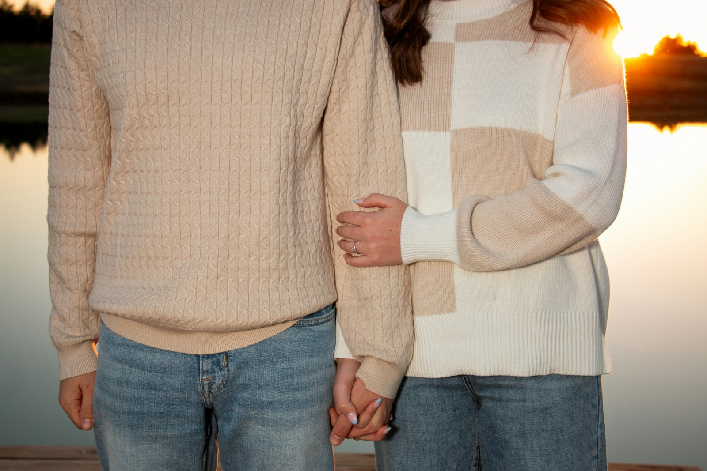

# Guide : remplacer les images par vos vraies photos

Le site `studio-bobine.html` fonctionne dès maintenant : chaque image est un
placeholder coloré intégré dans le fichier (aucune dépendance, jamais d'erreur).
Quand vous voulez mettre vos vraies photos, voici comment faire.

## Méthode simple, en 3 étapes

### 1. Télécharger des photos gratuites

Sur un de ces sites (gratuits, usage commercial autorisé, sans attribution) :

- Unsplash — https://unsplash.com
- Pexels — https://pexels.com
- Pixabay — https://pixabay.com

Cherchez par exemple : « travel couple », « family vacation », « content creator »,
« mountain hike », « road trip ».

### 2. Créer les dossiers et y déposer les photos

À côté de `studio-bobine.html`, créez un dossier `images/` contenant ces
sous-dossiers et fichiers, en respectant exactement les noms ci-dessous :

```
images/
├── hero/
│   ├── couple-lac.jpg        (grande photo, ex. couple en voyage)
│   ├── montagne.jpg          (paysage de montagne)
│   └── famille-rando.jpg     (famille en randonnée)
├── icp/
│   ├── createur.jpg          (créateur de contenu en tournage)
│   ├── couple.jpg            (couple en voyage)
│   ├── famille.jpg           (moment de famille)
│   └── aventure.jpg          (voyage / aventure)
├── portfolio/
│   ├── road-trip.jpg
│   ├── reel-produit.jpg
│   ├── ete-famille.jpg
│   ├── vlog-quotidien.jpg
│   ├── mariage.jpg
│   └── trek.jpg
├── avatars/                  (portraits, idéalement carrés)
│   ├── client-1.jpg
│   ├── client-2.jpg
│   ├── client-3.jpg
│   ├── client-4.jpg
│   ├── lucas.jpg
│   ├── sarah.jpg
│   ├── emma-yanis.jpg
│   └── camille-theo.jpg
├── blog/
│   └── filmer-vlog.jpg
└── contact/
    └── fond.jpg
```

Note : le blog contient trois articles mais deux vignettes réutilisent des visuels
du portfolio. Seule `blog/filmer-vlog.jpg` est spécifique ; pour les deux autres,
vous pouvez pointer vers des photos du portfolio (voir étape 3).

### 3. Brancher les photos dans le code

Dans `studio-bobine.html`, chaque image ressemble à ceci :

```html

```

L'attribut `data-local` vous indique le nom de fichier prévu pour cette image.
Il suffit de remplacer tout le `src="data:image/svg+xml;base64,..."` par le
chemin local, soit :

```html

```

Faites-le pour chaque image. Astuce : cherchez `data-local=` dans le fichier
(Ctrl+F) pour les trouver toutes rapidement.

## Encore plus simple : laisser Claude Code le faire

Si vous utilisez **Claude Code** ou **Cowork** (qui tournent sur votre ordinateur
avec votre connexion internet), vous pouvez déléguer entièrement la tâche.
Exemple de demande :

> « Dans studio-bobine.html, télécharge des photos libres de droits adaptées à
> chaque attribut data-local depuis Unsplash, place-les dans un dossier images/
> en respectant les chemins indiqués, puis remplace chaque src en base64 par le
> chemin local correspondant. »

Claude Code peut chercher, télécharger, renommer et modifier le code de bout en
bout — ce que l'interface de chat ne peut pas faire, faute d'accès réseau.

## Conseils photos

- Format **paysage** pour hero, portfolio, ICP et blog ; format **carré** pour les avatars.
- Compressez les images (par ex. sur https://squoosh.app) pour un site rapide :
  visez moins de 300 Ko par photo.
- Gardez une cohérence de tons (lumineux, chaleureux) pour un rendu pro.
- Le mieux reste d'utiliser **vos propres réalisations** dans le portfolio :
  rien ne vend mieux votre travail que votre travail.
